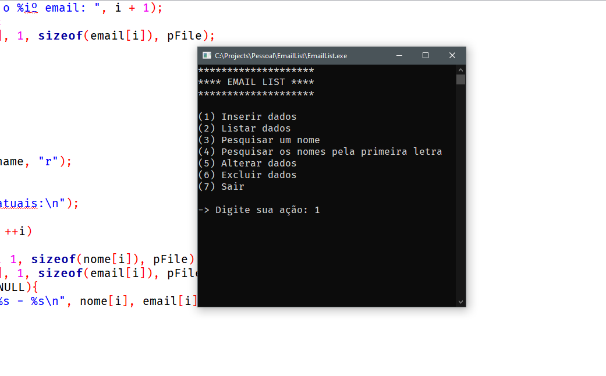

# :page_with_curl: Sobre
Programa desafio da disciplina Linguagem de Programação I da Fatec Rubens Lara

1 – Pesquise as funções de biblioteca abaixo que manipulam arquivos.
- fopen();
- fclose();
- fwrite();
- fread();
- fseek(); 
- exit(0); 

2 - Escreva um programa que tem 1 vetores bidimensional nome[3][20] e 1 vetores bidimensional email[3][30] declaradas como variáveis globais.
Na função main() faça um menu com as seguintes funções: 
- Entrada de dados.
- Lista todos os dados na tela.
- Pesquisa um nome e mostra na tela
- Pesquisa os nomes pela 1. letra e mostra todos na tela.
- Altera dados.
- Exclui dados.
- Saída

## :hammer: Instalação

````bash
# Clone este projeto
$ git clone https://github.com/rbmelolima/EmailList

# Compile o EmailList.c

# Execute o .exe
````

